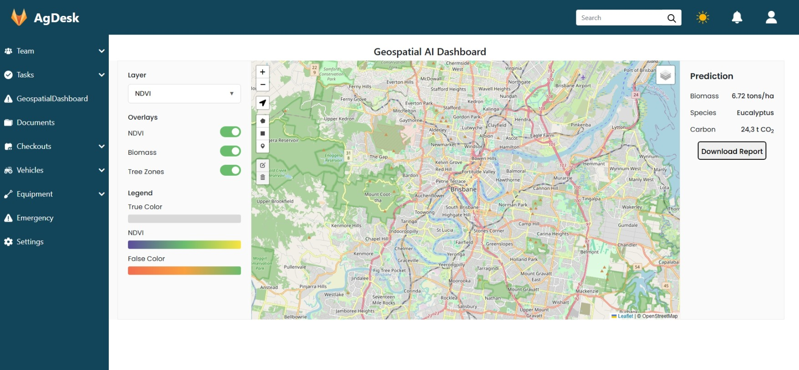
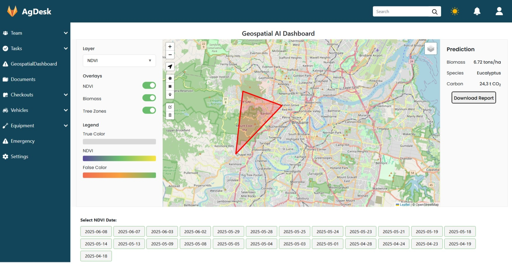
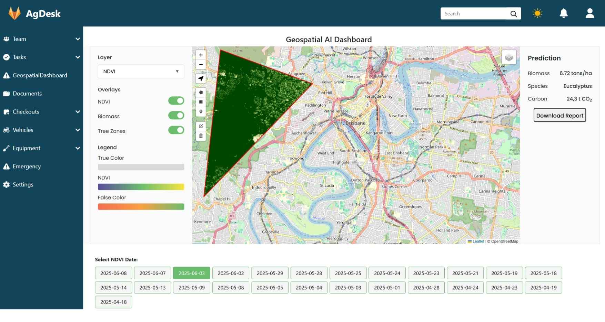

# Geospatial AI Dashboard – NDVI-Based Tree Monitoring System
*Satellite-powered vegetation health monitoring with interactive polygon-based analysis*




*Example: NDVI visualization with custom polygon boundary*
## Project Overview
Developed an AI-powered geospatial dashboard that:
- Automates retrieval of Sentinel-2 satellite imagery
- Computes Normalized Difference Vegetation Index (NDVI) for vegetation health analysis
- Enables interactive boundary creation for Area-of-Interest (AOI) monitoring
- Provides time-series comparison of tree cover changes

## Key Features

### 🛰️ Satellite Data Pipeline
- **Automated Imagery Ingestion**  
  Celery-driven pipeline fetching Sentinel-2 data via SentinelHub API
- **NDVI Computation Engine**  
  Rasterio + NumPy processing stack calculating vegetation indices
- **Redis-backed Task Queue**  
  Asynchronous processing for large-scale geospatial operations

### 🗺️ Interactive Visualization
- **Polygon-based AOI Definition**  
  Leaflet.js interface for drawing custom boundaries
- **NDVI Layer Rendering**  
  Dynamic visualization clipped to user-defined geometries
- **Multi-layer Control**  
  Toggle between satellite imagery, NDVI heatmaps, and mask overlays

### ⚙️ Backend Architecture
```plaintext
Django Application Structure:
├── tasks.py       - Celery workers for imagery processing
├── models.py      - PostGIS-enabled spatial data models
├── views.py       - REST endpoints for frontend integration
└── geo_utils.py   - Vector/raster intersection handlers
